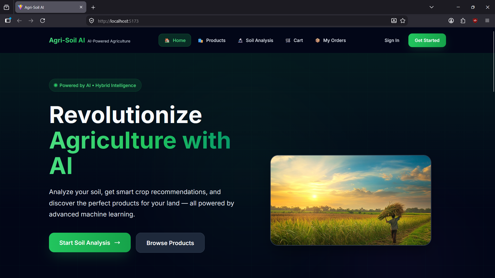
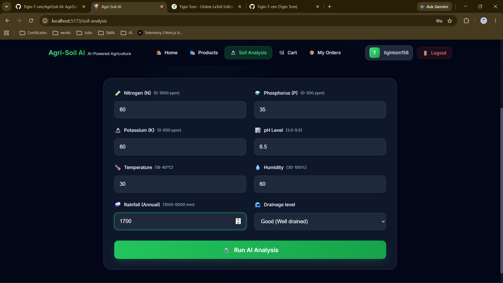

# 🌱 Agri-Soil AI

An AI-powered agricultural platform that helps farmers analyze soil, get crop recommendations, and find related agricultural products.

Built with **React, FastAPI, Python, Machine Learning, SQLite, and Razorpay**.

## ✨ Features

- 🔬 AI-based soil classification
- 🌱 ML-powered crop recommendation
- 🧠 Hybrid ML + agricultural rule validation
- 💧 Drainage and waterlogging warnings
- 🛒 Crop-based seed and fertilizer recommendations
- 💳 Razorpay test-mode payment integration
- 🚚 District-based delivery staff assignment
- 📊 Admin analytics and product management
- 🔐 JWT authentication with role-based access
- 🌐 Google and Twitter/X login support

## 🤖 Machine Learning

Two Random Forest models are used:

| Model | Purpose | Classes | Test Accuracy |
|---|---|---:|---:|
| Soil Classification | Predict soil type | 11 | 97.59% |
| Crop Recommendation | Recommend suitable crops | 23 | 81.66% |

### Input Features

- Nitrogen (N)
- Phosphorus (P)
- Potassium (K)
- Temperature
- Humidity
- pH
- Annual Rainfall

The system also performs feature engineering using nutrient ratios, fertility indicators, and environmental stress values.

### Hybrid Recommendation Flow

```text
Soil & Environment Input
          ↓
   Soil Classification
          ↓
    Crop Prediction
          ↓
Agricultural Rule Validation
          ↓
 Best Valid Crop Recommendation
          ↓
 Seeds / Fertilizers
```

## 🏗️ Architecture

```text
React Frontend
      ↓
Axios / HTTP
      ↓
FastAPI Backend
      ↓
Service Layer
 ┌────┼───────────┐
 ↓    ↓           ↓
ML   Rules     Payments
 ↓    ↓           ↓
RandomForest   Razorpay
      ↓
   SQLite
```

The frontend handles the user interface, while FastAPI manages authentication, ML predictions, business logic, payments, orders, and database operations.

## 🛠️ Tech Stack

**Frontend:** React, Vite, Tailwind CSS, Axios, Recharts  
**Backend:** FastAPI, Python, Pydantic, SQLAlchemy  
**ML:** Scikit-learn, Random Forest, Pandas, NumPy, Joblib  
**Database:** SQLite  
**Authentication:** JWT, bcrypt, OAuth  
**Payments:** Razorpay  
**Tools:** Git, GitHub

## 📸 Screenshots

```markdown
### Dashboard 



### Soil Analysis


### Crop Recommendation


### Marketplace


### Cart Page


```

## ⚙️ Installation

### 1. Clone the repository

```bash
git clone https://github.com/Tigin-T-om/YOUR-REPOSITORY.git
cd YOUR-REPOSITORY
```

### 2. Backend Setup

```bash
cd backend
python -m venv .venv
```

**Windows:**

```bash
.venv\Scripts\activate
```

Install dependencies:

```bash
pip install -r requirements.txt
```

Create a `.env` file and add the required configuration:

```env
DATABASE_URL=sqlite:///./agrisoil.db
SECRET_KEY=your_secret_key
RAZORPAY_KEY_ID=your_test_key
RAZORPAY_KEY_SECRET=your_test_secret
```

Start FastAPI:

```bash
uvicorn app.main:app --reload
```

Backend: `http://localhost:8000`

API documentation: `http://localhost:8000/docs`

### 3. Frontend Setup

Open another terminal:

```bash
cd frontend
npm install
npm run dev
```

Frontend: `http://localhost:5173`

> Use test credentials for third-party services. Never commit real API keys or secrets to GitHub.

## 🚀 How It Works

1. User enters soil and environmental parameters.
2. FastAPI sends the data to the ML service.
3. Soil type is predicted using the Soil Random Forest model.
4. Crop suitability is calculated using the Crop Random Forest model.
5. Agricultural rules validate the ML recommendations.
6. The best valid crop is selected.
7. Related seeds and fertilizers are displayed.
8. Users can add products to the cart and complete a test payment.

## 📊 Database

The application uses **SQLite** with SQLAlchemy.

Main entities:

- Users
- Products
- Orders
- Order Items
- Delivery Staff

## ⚠️ Current Limitations

- Datasets are synthetic/generated for the project.
- Crop model accuracy is **81.66%**, not 97.6%.
- Razorpay is configured for test payments.
- Product matching currently uses keyword-based matching.
- Production deployment would require stronger secret management and scalability improvements.

## 🎯 What I Learned

- Building ML prediction pipelines
- Feature engineering and model evaluation
- Combining ML with rule-based decision systems
- Developing REST APIs with FastAPI
- JWT authentication and role-based access
- Database design with SQLAlchemy
- React frontend development
- Payment verification workflows
- E-commerce and delivery management logic

## 👨‍💻 Author

**Tigin Tom**  
MCA Graduate | Python | Backend Development | AI/ML

- GitHub: https://github.com/Tigin-T-om
- LinkedIn: https://www.linkedin.com/in/tigintom/
